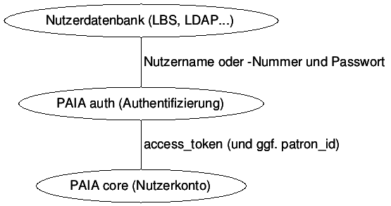

# Schnittstellen Allgemein

## Schnittstellen

Wofür werden Schnittstellen benutzt?

* **Daten rein** (Katalogdaten ändern...)
* **Daten raus** (Titeldaten suchen, Status abfragen...)
* **Aktion anstoßen** (Medium vormerken...)

...und zwar automatisierbar (das Gegenteil von Geschäftsgang)!

## Schnittstellen

Arten von Schnittstellen

* ~~Nutzerschnittstellen / Benutzeroberflächen~~
* ~~Interne Programmierschnittstellen~~
* **Web-APIs** / **Web-Services**

Technische Umsetzung

* Meist JSON oder XML über HTTP[S]
* Meist einfache URL-Anfragen (GET/POST):\
  <http://example.org/etwas/damit?machen=los>

Buzzwords: *REST*, *Mashup*, *Web 2.0*, *SOA* ...

## Serviceorientierter Architektur

Vorteile

* Grundfunktionen kombiniertbar ("Lego-Bausteine")
* Unabhängig von Komponenten *hinter* der Schnittstelle

    * z.B. RSS/Atom, SRU, OAI-PMH... aus beliebigen Systemen
    * z.B. DAIA an *LBS3*, *LBS4*, *Koha*, *aDIS/BMS*...

Nachteile

* Schnittstellen müssen sauber spezifiziert werden
* Schnittstellen mussen sauber implementiert werden

## Saubere Schnittstellen

* Einfach zugänglich: **öffentlich und frei über HTTP(S)**
* Gut dokumentiert: **genaue Spezifikation**
* Unabhängig voneinander: **klar abgegrenzter Zweck**

## Saubere Schnittstellen

Technische Spezifikation

* Nicht zu komplex (überschaubar) 
* Nicht zu ungenau (formal und exakt)
* Nicht zu abstrakt (wenige Freiheitsgrade)
* Nicht zu speziell (unabhängig von Software, Sprache...)
* Nicht zu allgemein (ein Anwendungsfall pro API)

Umsetzung

* Getestet

Bei PAIA: Spezifikation durch *VZG*, Implementierung jeweils durch *shiphrah GmbH*
und *effective WEBWORK GmbH*.

# Patrons Account Information API (PAIA)

----

![Paia, Hawaii^[CC-BY-SA by Skier Dude, Wikimedia Commons]](img/paia.jpg)

## Motivation

Schnittstelle zum Nutzerkonto

* Anzeige von Ausleihen, Vormerkungen, Gebühren...
* Ausführen von Vormerkungen und Bestellungen
* Passwort ändern

Anwendung

* BibApp
* VuFind
* *freie Verwendung*\
  Benachrichtigungssysteme, Lernumgebungen, Skripte, Apps...

## PAIA Spezifikation

Öffentlich unter <http://gbv.github.io/paia/>

Abstraktion von Ausleihsystemen (keine PICA-Besonderheiten)

PAIA besteht aus zwei Teilen:

* **PAIA auth** (Zugangsdaten)\
  z.B. [https://paia.gbv.de/isil/DE-Hil2/**auth**/*methode*](https://paia.gbv.de/isil/DE-Hil2/core/)

* **PAIA core** (Nutzerkonto)\
  z.B. [https://paia.gbv.de/isil/DE-Hil2/**core**/*methode*](https://paia.gbv.de/isil/DE-Hil2/auth/)

JSON-Antwort auf Methode und Anfrage-Parameter

## PAIA auth

`HTTP POST login`
  : Zugriff gewähren (Nutzername und Passwort)

`HTTP POST logout`
  : Zugriff entziehen

`HTTP POST change`
  : Passwort ändern

* Mit jedem login ein neues `access_token`
* Token gilt für begrenzte Zeit, Nutzer und Aktionen (`scopes`)\
  z.B. nur Lesezugriff, nur ein bestimmter Nutzer ...
* Kompatibel mit dem OAuth-Standard

## PAIA auth

Keine Nutzernummern oder -Passwörter in PAIA core.

<!--
~~~   
Nutzerdatenbank (LBS, LDAP...)
    ^
    |
    |  Nutzername und Passwort
    |
    v
PAIA auth (Authentifizierung)
    ^
    |
    |  access_token (und ggf. patron_id)
    |
    v
PAIA core (Nutzerkonto)

 graph {
nutzer [label="Nutzerdatenbank (LBS, LDAP...)"];
  nutzer -- auth [label=" Nutzername oder -Nummer und Passwort"];

   auth [label="PAIA auth (Authentifizierung)"];

   auth -- core [label=" access_token (und ggf. patron_id)"];
  core [label="PAIA core (Nutzerkonto)"];
 }
~~~
-->

## PAIA core

Zugriff auf das Benutzerkonto:

`HTTP GET patron` 
  : Nutzerinformationen (Name, Email, Status)

`HTTP GET items` 
  : Nutzerkonto (Ausleihen, Vormerkungen...)

`HTTP GET fees` 
  : Gebühren

`HTTP POST request` 
  : Vormerkung, Bestellung...

`HTTP POST renew` 
  : Verlängerung

`HTTP POST cancel` 
  : Stornierung

## Aktuelle Umsetzung

* LBS-Screenscraping von *effective WEBWORK GmbH*
* Nativer Server (LBS3-Protokoll) von *shiphrah GmbH*
* Proxy <http://paia.gbv.de/> für saubere URLs

    * z.B. <http://paia.gbv.de/isil/DE-Hil2/auth>

# Strategie und Planungen

## Schnittstellen-Übersicht

Schnittstellen im GBV-Wiki: <http://ws.gbv.de/>

SRU und Z39.50
  : für Suche und Abruf von Datensätzen
unAPI
  : für den Abruf einzelner Datensätze
SeeAlso
  : für den Abruf von Links und Empfehlungen
DAIA
  : für den Abruf von Verfügbarkeitsinformationen
PAIA
  : für Zugriff auf Benutzerkonten
Linked Data
  : für Standortverwaltung und Datenbankinfos

Je Konfiguration, desto Aufwand.

## Grundsätze

* Saubere Schnittstellen brauchen Zeit für Entwicklung, Dokumentation und Tests
* Einheitliche Identifier (URIs) für Objekten in allen Schnittstellen\
  z.B. basierend auf ISIL für Bibliotheken
* Wichtig zu klären:
    * Was für Objekte haben wir eigentlich?
    * Was für Grundfunktionen brauchen wir?

## Nächste Schritte

* DAIA ausbauen und Konfiguration vereinfachen
* PAIA für LBS3 + LBS4 sowie in VuFind
* Mehr Clients für Schnittstellen programmieren
* Prioritäten für weitere Schnittstellen klären
* ...

## ...5 Jahre zuvor

Jakob Voß (Mai 2008 in Frankfurt):\
*Mit Webservices zum Katalog 2.0. Warum Mashups und Serviceorientierte 
Architektur mehr als Buzzwords sind*\
<http://de.slideshare.net/nichtich/mit-webservices-zum-katalog-20>
